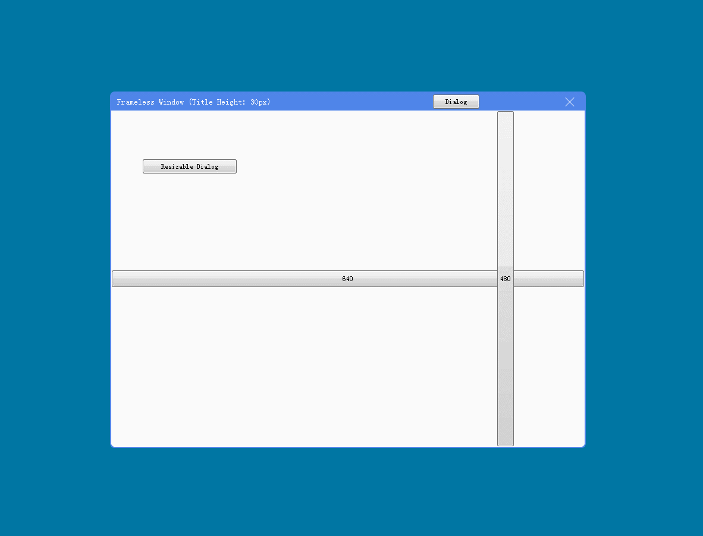

[>>> 中文版](README_ch.md)

# 1. FramelessWindow
When I started using Qt as UI library, I found that Qt didn't provide a perfect borderless window solution to support the following functions, and I have to implement these functions by myself:

1. Support to change the position and size of the window by dragging the mouse; ✅
2. Support double-click the title bar to maximize/restore the window; ✅
3. Support `Windows Areo Snap` feature;
4. Support system shadow;
5. Support dragging across screens that have different DPI; ✅
6. Automatically adapt to changes in resolution and DPI; ✅
7. Automatically near to screen edge; ✅

# 2. Implementation scheme comparison
There are two schemes for implementing borderless windows in Qt.

## 2.1 Scheme 1
By overriding `nativeEvent` function to hook windows message(such as 'WM_NCHITTEST`), the general steps are as follows:
1. Set the `WS_THICKFRAME | WS_CAPTION` property to restore the window border and title, so that the window can receive the` WM_NCHITTEST` message.

2. Then remove the border and title in the `WM_NCCALCSIZE` message processing.

3. Set the mouse behavior (`HTLEFT`,` HTRIGHT`, etc.) by judging the mouse position in the `WM_NCHITTEST` message processing.

The advantage of this solution is that it can support the `Windows Areo Snap` and `System Shodow` feature, but it is very complicated for message processing and needs to be compatible with various versions of Qt. At present, I have not found a solution to achieve a perfect borderless through this solution.

As far as I know, the following open source projects are implemented in this way, but there are some problems, such as not supporting drag across screens that have different DPI screens, unable to adapt to resolution and DPI changes, and `WM_NCHITTEST` sometimes not responding, etc. In addition, after setting the background transparency property (such as `Qt :: WA_TranslucentBackground`), the system shadow feature will also disappear.

- qtdevs/FramelessHelper: [https://github.com/qtdevs/FramelessHelper](https://github.com/qtdevs/FramelessHelper)
- wangwenx190/framelesshelper: [https://github.com/wangwenx190/framelesshelper](https://github.com/wangwenx190/framelesshelper)

## 2.2 Scheme 2
This solution not hook windows `WM_NCHITTEST`,`WM_NCCALCSIZE` messages, nor does it change the window style, and is implemented by pure Qt. 

By setting MouseTracking for each Widget, make sure each Widget can respond to mouse events (mouseMoveEvent, mousePressEvent, mouseReleaseEvent, etc.), and then determine the mouse position in these events to set the shape and behavior of the mouse.

Although the logic for judging the position of the mouse is cumbersome in this way, the compatibility is better and pure, and it does not need to process various messages of Windows.

👉 **This project is implemented in this way, and can support all the features of the borderless form except "Windows Areo Snap" and "System Shadow" features mentioned above.**

# Screenshot On Windows

# 3. Sponsor
Thank you for using this project. It would be a great pleasure for me if this project can be of help to you.

**You can go to my Github [homepage](https://github.com/winsoft666) to make a donation.**